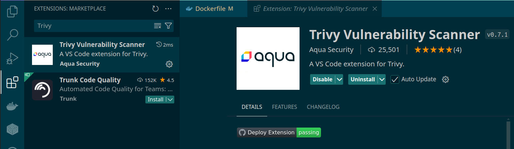
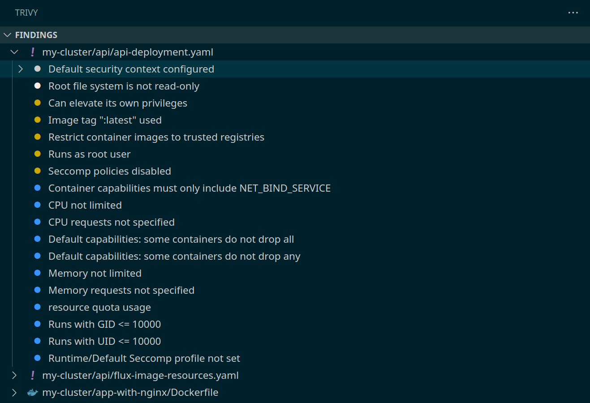
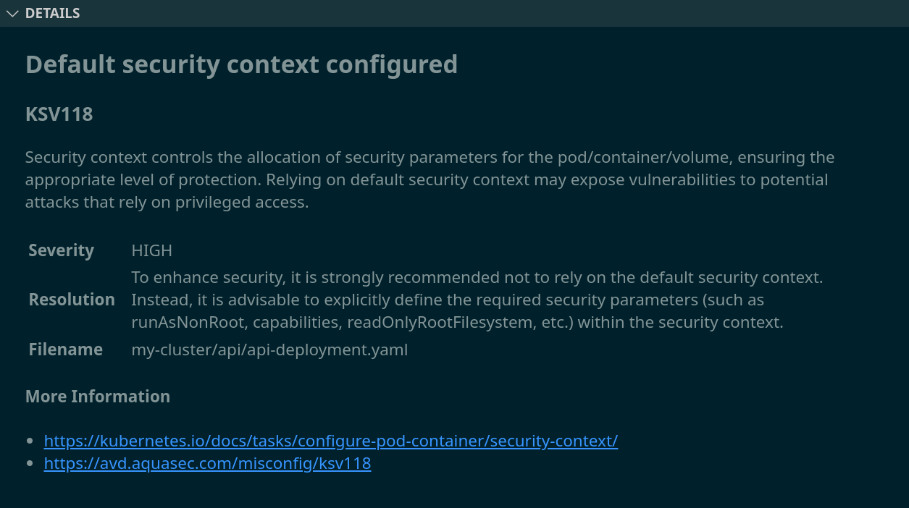

+++
title = 'Implementing Kubernetes SecurityContext best practices using the Trivy VS Code extension'
description = 'Using the Trivy VS Code extension to find and fix issues to adhere to Kubernetes best practices'
date = 2025-08-16T08:42:30+01:00
draft = false 
slug = "securitycontext-trivy-vscode-extension"
tags = ["Kubernetes", "SecurityContext", "Trivy"]
categories = ["kubernetes"]
+++

Staring at a wall of Trivy security findings in your Kubernetes manifests?
You're not alone. SecurityContext misconfigurations are among the most common
issues, but they're also the easiest to fix once you know what you're doing.

This guide shows you exactly how to fix each common Trivy finding using VS Code.
No fluff, just practical fixes with context on why they matter.

💡 Want to understand *why* these settings are important? Check out my companion
article: 
[What is a SecurityContext in Kubernetes and Why it Matters?]()

## Setup: Install Trivy Extension

Grab the **Trivy** extension from VS Code's marketplace. Search "Trivy" and
install it.



Once installed, the extension automatically scans files in your workspace. Open
the **Trivy** panel from the sidebar to see all findings in one place:



Click any finding for details:
- Finding ID and severity
- Brief description
- File location and line number
- Links to more info



Now let's fix them.

## Common Findings and How to Fix Them

Here are the SecurityContext findings you'll encounter most often, with
practical fixes. If you wish to understand more about the config options,
check out my other post 
[What is a SecurityContext in Kubernetes and Why it Matters?]()

### KSV118: Default security context defined

**What it means:** This finding appears when no SecurityContext is configured at
all. The wording can be confusing - it's flagging that you're using the
*default* (empty) security context, which is insecure.

**The fix:** Add a SecurityContext configuration to your container. Start
with the basics:

```yaml
securityContext:
  runAsNonRoot: true
  allowPrivilegeEscalation: false
  readOnlyRootFilesystem: true
```

Once you add any SecurityContext configuration, this finding will be resolved.
The specific settings you need depend on the other Trivy findings - see the
sections below for detailed guidance on each option.

### KSV106: runAsNonRoot not set / KSV012: runAsUser not set {#runasnonroot}

**What it means:** Trivy flags when containers might run as root (UID 0), which
gives attackers full control if compromised.

**The fix:** Set both `runAsNonRoot` and explicit UID/GID:

```yaml
securityContext:
  runAsNonRoot: true
  runAsUser: 10001
  runAsGroup: 10001
```

#### Finding your image's UID/GID

Check if your base image already has a non-root user. The root user ID is 0, so
you'll want it to be something else:

**Option 1: Run the image and check (works for most images)**
```bash
docker run --rm --entrypoint="" your-image:tag id
```

**Option 2: Check a running container**
```bash
docker exec your-container-name id
```

**Option 3: Inspect the image (only shows if USER directive was set)**
```bash
docker inspect your-image:tag | grep -i user
```

The `--entrypoint=""` overrides the image's default command, letting you run
`id` instead. Option 3 only shows if a `USER` was explicitly set in the
Dockerfile.

Common official images:
- **NGINX**: UID 101
- **Node.js**: UID 1000 (user `node`)
- **Alpine**: No default user (you'll need to create one)
- **Distroless**: Often UID 65532 (`nonroot`)

#### Creating a user in your Dockerfile

If your image doesn't have a non-root user, create one. Here are examples for
different base images:

**Debian/Ubuntu:**
```dockerfile
RUN groupadd --gid 10001 appuser \
 && useradd --uid 10001 --gid appuser --shell /bin/bash --create-home appuser
USER appuser
```

**Alpine:**
```dockerfile
RUN addgroup -g 10001 appuser \
 && adduser -D -u 10001 -G appuser appuser
USER appuser
```

**Why 10001?** High UIDs avoid conflicts with system users. Trivy likes them
too. But honestly, it is usually not an issue to use lower UIDs.

### KSV014: readOnlyRootFilesystem not set

**What it means:** Running with a writable root filesystem allows attackers to
modify files, install malware, or persist changes.

**The fix:** Make it read-only, then mount only what needs writes:

```yaml
securityContext:
  readOnlyRootFilesystem: true
volumeMounts:
  - name: tmp
    mountPath: /tmp
  - name: cache
    mountPath: /app/cache
volumes:
  - name: tmp
    emptyDir: {}
  - name: cache
    emptyDir: {}
```

**Common directories that need write access:**
- `/tmp` - Temporary files
- `/var/cache` - Application caches
- `/var/log` - Log files (if not sent to stdout)
- `/var/run` - Runtime files like PID files

**Example for NGINX:**
```yaml
volumeMounts:
  - name: nginx-cache
    mountPath: /var/cache/nginx
  - name: nginx-run
    mountPath: /var/run
```

### KSV003: allowPrivilegeEscalation not set {#allowprivilegeescalation}

**What it means:** Without this setting, processes could gain more privileges
than their parent, enabling exploitation.

**The fix:** Set to `false` (always, unless you're doing something very unusual):

```yaml
securityContext:
  allowPrivilegeEscalation: false
```

### KSV001: capabilities not dropped

**What it means:** Containers inherit Linux capabilities they don't need,
increasing attack surface.

**The fix:** Drop all capabilities by default:

```yaml
securityContext:
  capabilities:
    drop:
      - ALL
```

#### Adding back specific capabilities (if needed)

Some applications require specific capabilities. For example, binding to ports below 1024:

```yaml
securityContext:
  capabilities:
    drop:
      - ALL
    add:
      - NET_BIND_SERVICE
```

Most apps run on 8080/3000/etc and need zero capabilities.

### KSV104: seccomp profile not set {#seccompprofile}

**What it means:** Missing a seccomp profile to restrict system calls.

**The fix:** Use `RuntimeDefault` for 99% of applications:

```yaml
securityContext:
  seccompProfile:
    type: RuntimeDefault
```

This applies your container runtime's default profile—good security without the
hassle of custom configs.

### Complete SecurityContext example

Here's a complete SecurityContext configuration that addresses all Trivy findings:

```yaml
apiVersion: apps/v1
kind: Deployment
metadata:
  name: my-app
spec:
  template:
    spec:
      containers:
      - name: app
        image: my-app:v1.0
        securityContext:
          runAsNonRoot: true
          runAsUser: 10001
          runAsGroup: 10001
          allowPrivilegeEscalation: false
          readOnlyRootFilesystem: true
          capabilities:
            drop:
              - ALL
          seccompProfile:
            type: RuntimeDefault
        volumeMounts:
        - name: tmp
          mountPath: /tmp
        - name: cache
          mountPath: /app/cache
      volumes:
      - name: tmp
        emptyDir: {}
      - name: cache
        emptyDir: {}
```

## Re-scan and Validate

After your fixes:

1. Save your manifest
2. Run Trivy scan again
3. Watch those red squiggles disappear ✨

Rinse and repeat until clean. Any remaining findings? Address them or document
why they're acceptable risks.

## Bonus: Ignoring False Positives

Sometimes Trivy flags something that's actually fine. Suppress it with a `.trivyignore` file:

```
# .trivyignore - simple format
AVD-KSV-0001
CVE-2021-12345
```

Or add context (my preference):
```yaml
misconfigurations:
  - id: AVD-KSV-0012
    statement: This image uses UID 1000, but we need to use 10001 for our organization's standards. The UID exists in the image.
    paths:
      - "deployment.yaml"
  - id: AVD-DS-0026
    statement: Kubernetes does not support Docker Healthcheck, should use Kubernetes livenessProbe, readinessProbe and startupProbe
    paths:
      - "Dockerfile"
  - id: AVD-KSV-0011
    statement: We do not set the CPU limit in order for resources to get more resources when they need it, read https://home.robusta.dev/blog/stop-using-cpu-limits
    paths:
      - "deployment.yaml"
```

You can also use inline comments directly in your YAML manifests. See the 
[Trivy documentation on filtering](https://aquasecurity.github.io/trivy/latest/docs/configuration/filtering/)
for details.

Only ignore findings you've actually investigated. Future you will thank present you for the documentation.

## Wrapping Up

Trivy + VS Code makes fixing SecurityContext issues straightforward. No more
copy-pasting from documentation and hoping for the best.

**Quick wins:**
- Install Trivy extension → instant security feedback
- Fix findings systematically, not all at once
- Check if your image already has a non-root user
- Re-scan as you go

Want to understand the "why" behind these settings? Read: 
[What is a SecurityContext in Kubernetes and Why it Matters?]()

