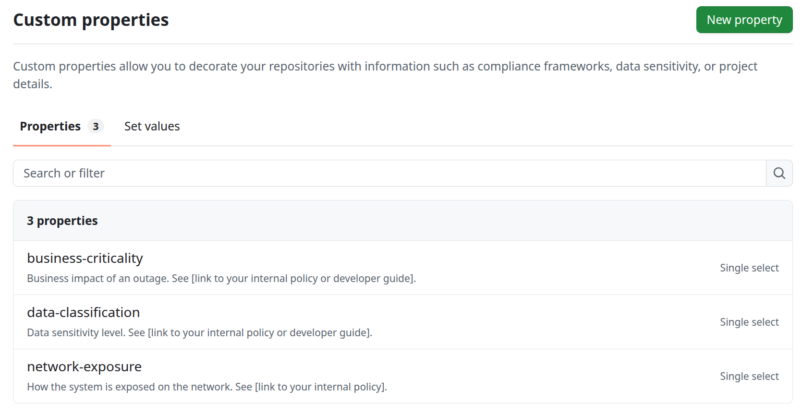
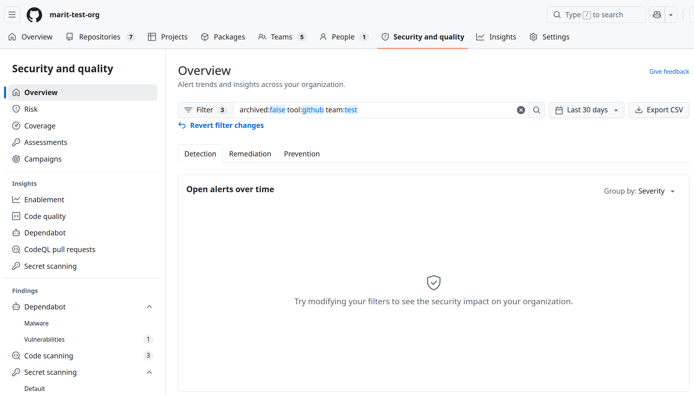
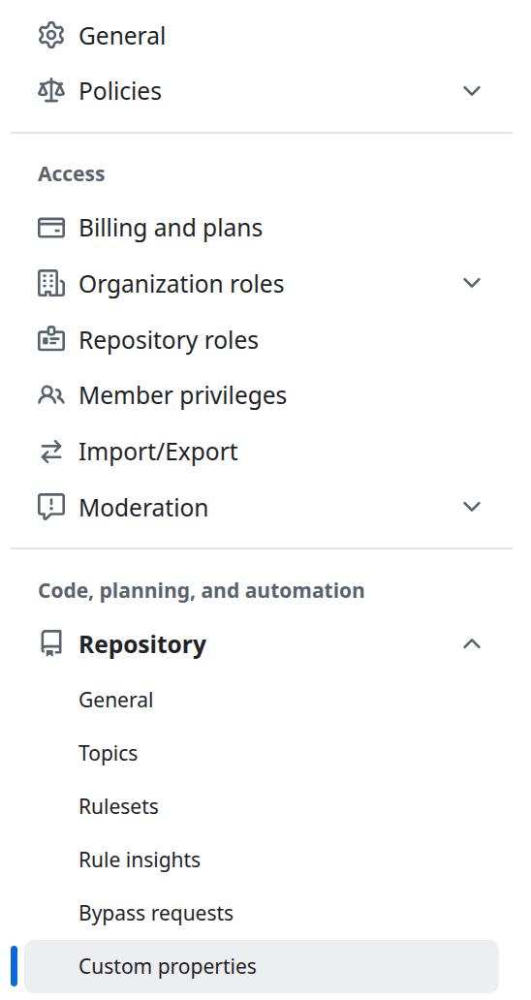
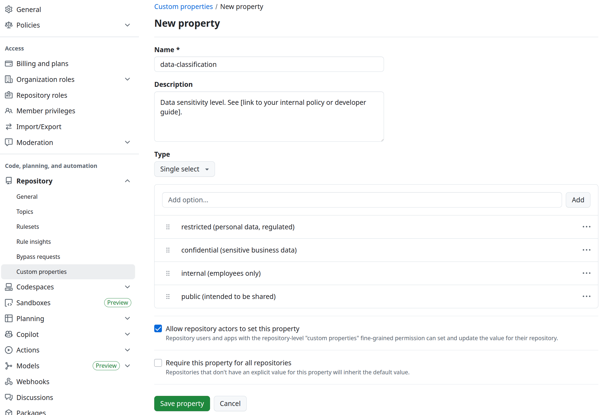

+++
title = 'Building a System Inventory in GitHub Enterprise'
date = 2026-04-29T10:00:00+02:00
draft = false
description = "How to use GitHub Enterprise Custom Properties to build a system inventory that holds up in an audit, supports incident response, and scales with your organization."
summary = "GitHub Enterprise Custom Properties give you a way to build a living system inventory without introducing another tool. This post covers the schema design, the three baseline properties used throughout the series, and how to enforce completeness with automation."
slug = "github-enterprise-system-inventory"
series = "appsec_github"
relatedPosts = ["appsec-program-github-intro", "appsec-kpis"]
tags = ["GitHub", "AppSec", "Governance", "GHAS"]
categories = ["appsec"]
+++



You can't protect what you don't know about. A system inventory is the
foundation of every application security governance program worth taking
seriously. Without one, incident response is slow, security prioritization is
guesswork, and auditors will flag it. It is not a spreadsheet from six months
ago, but a live inventory that tells you what is valuable for your organization,
such as who owns each system, how sensitive it is, and whether it's reachable
from the internet.

Most organizations have more running systems than they realize. Some were built
by teams that have long since moved on. Some were spun up for a project, never
decommissioned, and have been quietly accumulating Dependabot alerts for two
years. Some are internet-facing. Some handle personal data. And nobody knows.
Because nobody ever wrote it down, or what was written down is now months out
of date.

GitHub Enterprise gives you a way to build this inventory using
**Custom Properties**, without introducing yet another tool for teams to ignore.
Custom Properties give you structured metadata on every repository. On its own
that's just a database. Combined with rulesets, GitHub Actions, and the GitHub
API, the metadata becomes actionable. 

The inventory is the foundation that makes every other control in this series
possible. Without it, scan coverage, SLA tracking, secret exposure, etc., are
measuring the wrong population.

The examples in this post use the **hybrid model** (explained in the 
[series intro]()):
GHAS on high-risk systems, lighter baseline elsewhere. With that decided, it's
time to configure the inventory itself, starting with Custom Properties to store
repository metadata.

This post links to several pages inside your GitHub organisation. Enter your
org slug once below and every such link on the page jumps straight to your
org's settings or dashboards.



## Custom Properties as Repository Metadata

Custom Properties are key-value pairs. In GitHub, they consist of two parts:
- the property definitions **the AppSec engineer** configures at the organization 
  level (the schema) - [see GitHub Docs](https://docs.github.com/en/organizations/managing-organization-settings/managing-custom-properties-for-repositories-in-your-organization)
- the values **teams** set on each repository (using the schema the AppSec 
  engineer configured) - [see GitHub Docs](https://docs.github.com/en/enterprise-cloud@latest/admin/managing-accounts-and-repositories/managing-organizations-in-your-enterprise/custom-properties)

The goal is to have as few properties as possible, but enough to be meaningful
for your organisation. Meaningful means they strengthen processes you already
have: incident response, risk prioritisation, compliance scoping, vulnerability
prioritisation. A property that doesn't actively support a decision or a process
you care about adds friction without payoff.

Don't include properties just in case. Include a property when you're confident
it will be used and you know what you'll do with the data. Three well-maintained
properties are worth far more than ten that aren't really in use.

We use three properties as a baseline throughout this series:
`business-criticality`, `data-classification`, and `network-exposure`. These
three give you enough to tier security controls, measure inventory completeness,
and scope incidents. They are a starting point, not a one-size-fits-all schema.
The right set for your organisation depends on what decisions you need the
properties to support. A few additional candidates are listed at the end of
this post. 

The screenshot below shows how it looks in the repository Custom properties page
in GitHub.

## A Limitation Worth Knowing: Security Overview Filtering

GitHub's 
(**Security and quality** tab) is the primary dashboard for tracking security
posture across all repositories, filtering by team, property value, or repo
topic. It's also where department-level filtering runs into a limitation worth
knowing about before you configure anything.

A common need is to group repositories by department to see compliance status
per department, delegate accountability to department security owners, or give
each department a scoped view of their own systems. The natural assumption is
that GitHub's 
handles this: create a parent team per department, put project teams under it,
and filter Security Overview by the parent team. In practice, that doesn't
work.

The Security Overview lets you filter by team, but the filter only matches
repositories directly assigned to that team. Child teams are not included.
Filtering by the parent team returns nothing useful. The screenshot below shows
this: a parent team with several child teams, each with repositories running
security tools. Yet the Security Overview is empty:

There are a few ways to handle department-level filtering. Choose based on how
your organisation is structured:

**1. Skip it entirely.** If you don't need to filter by department, don't add
the complexity. The inventory properties — `business-criticality`,
`data-classification`, `network-exposure` — give you meaningful cross-cutting
views regardless of who owns what.

**2. Repository topics** (e.g. `dept-finance`, `dept-platform`) - [see GitHub Docs](https://docs.github.com/en/repositories/managing-your-repositorys-settings-and-features/customizing-your-repository/classifying-your-repository-with-topics). 
Topics are filterable in Security Overview and stay outside the Custom
Properties schema *— no extra fields for developers to fill in*. Department
affiliation is already registered in GitHub through team membership; topics let
you expose that in Security Overview without asking developers to enter the same
information that already exists in GitHub. Set them as an admin, not by
developers. There's no bulk topic editor in the UI, so for existing repositories
the only "real" option is scripting it via the GitHub API. For new repositories,
this works well with a *controlled creation process*: setting the topic is
part of the repo creation. If anyone can create repositories freely without
going through a process, topics won't be applied consistently. Then I suggest
using option 3 instead.

**3. A `department` Custom Property.** The fallback when repo creation is
uncontrolled. A Custom Property surfaces in the repository settings UI and is
harder to miss than a topic buried in the About section. The downside: it adds a
field to your schema, and you're asking developers to enter information GitHub
already has through team membership. Expect some friction and some stale data.

**4. Separate GitHub organisations per department.** Full separation — each
department gets its own GitHub organisation, its own Custom Properties schema,
and its own Security Overview. This solves the filtering problem completely, but
at significant cost: there's no longer a single view across the organisation.
Cross-department incidents require coordination between org owners. Policies
can drift apart between departments. And someone still needs to ensure no system
falls through the gap between organisations. This is a structural choice worth
thinking through carefully before committing to it.

In this post, we are using **repository topics**. 


Options 2 and 3 are compatible with keeping org-wide oversight. Someone can
still see everything from the top while department managers filter to their own
slice. Option 4 makes that impossible without additional tooling.

Delegating visibility is good. Delegating accountability is good. In most cases,
someone should own the org-wide picture: setting the policy, maintaining the
schema, and making sure no system is invisible to everyone. That function
shouldn't be split across departments. _It should sit above them._


## Configuring the Schema

The schema is yours to design, and it's worth getting right before you roll
it out, because changes are painful once properties are in use.

### Who Can Create Properties

**Organization owners** (or users with the "Manage custom properties
definitions" permission) can define the schema. Setting *values* on a
repository only requires write access. Once the schema is in place, teams
populate their own repos without elevated privileges.



There are two places in GitHub settings that mention custom properties, and they
are not the same thing.

- **Enterprise settings → Custom properties** — Defines properties pushed down to *all* organizations in the enterprise. Requires enterprise owner access.
- **Organization settings → Code, planning, and automation → Repository → Custom properties** — Defines properties for *your organization only*. This is the one you want.

The "Repository" sub-menu item is easy to miss. Going directly to "Custom
properties" at the top level of org settings lands you in the enterprise-scoped
view if your org is part of an enterprise.


### Defining the Properties


Once a property is in use, you can't rename values, you can't delete a value
that's been set on any repository, and you can't change the type. Get the
schema right before rolling it out.  Especially the value names, since those are
what end up in rulesets, API queries, and automation.



Setting a property as required forces you to specify a default value, which
silently propagates to every repository that hasn't explicitly set it. A repo
classified as `business-critical` by default because nobody filled it in is
worse than no classification at all. Enforce completeness through automation
instead, as described in section [Enforcing Property Completeness](#enforcing-property-completeness).


GitHub limits property descriptions to 255 characters, option values to 75
characters, and doesn't support per-option descriptions. That's not enough
space to explain the distinctions between values properly. Two approaches that
help in practice:

- **Make option names self-explanatory.** The 75-character limit gives you
  enough room to add context: `restricted (personal data, regulated)` is far
  clearer than a bare `restricted`, and a developer who has never read the
  classification policy can still make the right choice.
- **Link to external documentation from the description field.** Use the 255
  characters for a one-sentence summary and a URL to your internal wiki or
  runbook. Don't put the option definitions in the description — people often
  skip it and go straight to the dropdown, so the option names should carry the
  meaning.

To create a property, go to your organization's  as shown
in the screenshot below.

### The Three Baseline Properties

These are the three properties used throughout this series. Together they tell
you a lot about the risk each system poses to the organisation: how bad an
incident would be (`business-criticality`), how sensitive the data is
(`data-classification`), and how exposed the system is to attackers
(`network-exposure`). That combination gives you what you need to tier security
controls, measure inventory completeness, and scope incidents — with the minimum
amount of developer friction. 

The tabs below show an example implementation of these properties. 



**Description**: *Business impact of an outage. See [link to your internal policy or development guide].*  
**Type**: Single select

**Values**:  
`mission-critical (outage = immediate crisis)`  
`business-critical (hurts within hours or days)`  
`important (workarounds exist)`  
`non-critical (minimal business impact)`

Tie values to something concrete, explained in more detail in your development
guide:

- **mission-critical**: Outage = immediate crisis. Directly tied to core
  business operations or safety. Payment processing, authentication, production
  control systems.
- **business-critical**: Serious consequences within hours or days. The business
  doesn't stop immediately, but it hurts. CRM, ERP, customer-facing services.
- **important**: Noticeable impact, but workarounds exist. Internal portals,
  reporting tools, secondary integrations.
- **non-critical**: Minimal business impact. Development tools, test
  environments, archive systems.

The value names are intentionally descriptive enough to stand alone — a
developer who has never read the policy can still distinguish `mission-critical`
from `important` without clicking a link.



**Description**: *Data sensitivity level. See [link to your internal policy or development guide].*  
**Type**: Single select

**Values**:  
`public (intended to be shared)`  
`internal (employees only)`  
`confidential (sensitive business data)`  
`restricted (personal data, regulated)`

These four levels map directly to standard data classification frameworks.
The critical thing is to publish what each level means *for your organization*
before teams start filling in values — the label is useless if one team's
`confidential` is another team's `internal`. Use the description field to link
to that definition.



**Description**: *How the system is exposed on the network. See [link to your internal policy or development guide].*  
**Type**: Single select

**Values**:  
`open-internet (publicly reachable)`  
`vpn-only (requires VPN)`  
`restricted-access (e.g. IP allowlist or firewall)`  
`local-only (internal network only)`

These four values give you enough granularity to scope penetration tests, tier
security controls, and answer "is this reachable from the internet?" without
ambiguity:

- **open-internet**: Reachable by anyone without authentication at the network level.
- **vpn-only**: Only accessible via VPN — not reachable from the public internet.
- **restricted-access**: Access is limited by some other network control, such as IP allowlisting, firewall rules, or private peering. Not publicly reachable, but not requiring VPN authentication either.
- **local-only**: Only reachable within the local network or between internal services.




GitHub's built-in archive function covers whether a system is live or retired.
Use it as part of your decommissioning process rather than adding a property for
it. So that every non-archived repository is a live system that needs an owner
and accurate metadata.


### Additional Properties Worth Considering

You can expand the schema later, but each addition should be deliberate. Before
adding a property, be able to answer: what decision does this support, and what
process will keep it accurate? If the answer isn't clear, don't add it yet.

- **`data-types`** — The categories of data the system handles. Useful for GDPR Article 30 records and scoping breach notifications.
- **`hosting-platform`** — Where the system runs. Useful during cloud provider incidents and for scoping infrastructure reviews.
- **`dpia-completed`** — Whether a Data Protection Impact Assessment has been conducted. Required evidence for GDPR compliance on systems handling personal data.
- **`authentication-type`** — How users or systems authenticate. Useful for identifying weak auth mechanisms and scoping identity-related incidents. Or tailoring requirements.

Some of these may already live elsewhere. `data-types`, for example, is often
captured during threat modelling. Don't ask developers to enter the same
information in two places.

## Enforcing Property Completeness

A system inventory that relies on developers discovering on their own that
properties need filling in isn't a system inventory. It's a wishlist. Properties
buried in a settings menu don't surface themselves: some repositories never get
classified, some get stale values nobody has reviewed in years, and AppSec
owners quietly lose visibility. For the inventory to stay trustworthy, the
system has to detect what's missing, notify the right people, and make it easy
to fix.

A workable shape is two scheduled workflows that close the loop:

- **A weekly audit.** Walks every repository, checks for missing required
  properties, and either opens an issue or comments on the existing one.
  Findings are grouped per owning team so each team gets a single notification
  listing only their repositories.
- **A monthly summary.** Calculates the overall completeness percentage per
  department and sends a manager-level rollup so visibility doesn't stop at
  the team that owns the repo.

There are many ways to build this loop, and the right one depends on your
existing tooling, your channels, and how your teams are organised. Pick the
shape that your organisation will actually read.

If you'd like a concrete starting point rather than a blank file, there is a
companion project at
[github.com/maritiren/github-appsec-audit](https://github.com/maritiren/github-appsec-audit).
It runs the two workflows above against a GitHub org using a GitHub App for
short-lived tokens, opens issues on non-compliant repositories, and posts
per-team Microsoft Teams cards. The notification layer is a pluggable
`Notifier` Protocol, so swapping Teams for Slack, email, or anything else is
one new module and one line in a dict. The README walks through the App setup,
and how to modify it to your communication channels. Clone it, adapt the matrix
to your departments, change the required property names, replace the notifier.
Whatever fits. The point of linking to it is to give you a working reference,
some inspiration.


Teams is one option, but the right channel depends entirely on how your
organisation works. Slack, email, or a combination all work. There's no single
right answer.

What usually doesn't work well on its own: GitHub notifications. @mentions and
issue subscriptions are easy to tune out, and most people's notification
settings mean they'll miss them. Except for teams with a project manager
checking all new issues.


### Keeping values fresh

A filled-in property can go stale just as quietly as a missing one. A system
that was `non-critical` two years ago may have grown into something that
handles personal data and is now internet-facing. The audit workflow above
catches *missing* values, not *outdated* ones.

The simplest model is a second workflow that mirrors the weekly audit, but on a
yearly cadence. Instead of "this property is missing", the issue asks the owning
team to confirm that the current values still reflect reality. The team closes
the issue once they have reviewed. If they haven't, it shows up in the next
monthly summary alongside other stale issues, and the AppSec owner sees who is
behind.

The detection logic is different, but the surrounding scaffolding — grouping by
team, notifying the team, feeding the monthly summary — is the same. That gives
a record of when each system was last reviewed, without adding a separate
process.

### Extending Reports with a Hygiene Score

The same workflow that checks property completeness can be extended to score
each repository's security hygiene. With the inventory metadata in place, you
can compute a simple score per repo based on observable signals: are required
scans enabled, is branch protection in place, are there open critical findings
past SLA, did anyone bypass enforcement rules last month?

A per-repo score turns the completeness report into something more actionable.
Instead of "these repos are missing properties", the AppSec report can say:
"these three repositories have the lowest hygiene scores this month", with a
direct link to

for the full picture.

The team report can surface the same score at team level, making it easy for
developers to understand exactly what is pulling their score down and what to
fix. For a consulting firm, this kind of reporting is particularly valuable for
internal development: engineers who work on internal systems get a concrete
feedback loop on the basics every developer should know before they go to a
client. A developer who has learned to care about branch protection, scan
coverage, and open findings on their own team's work is a more capable and
credible consultant.

What signals to include and how to weight them is a design decision for your
organisation. The reports are only as useful as the actions they trigger.

---

With the inventory in place, the next step is setting a baseline that applies
to every repository regardless of risk tier. That's covered in
[Repository Defaults and Rulesets]().


Custom Properties are useful, but some rough edges make adoption harder than it needs to be.

**No descriptions on individual select options.** Each property has a single
description field with a 255-character limit. It is enough for a brief summary
of the property itself, but not nearly enough to explain what each value means.
Option values themselves are capped at 75 characters. When a developer opens a
dropdown and sees `mission-critical`, `business-critical`, `important`,
`non-critical`, they have no in-context guidance to distinguish them. The
explanation ends up in a wiki page nobody reads, or in the property description
where all values compete for space. Allowing a short description per option
would make self-service classification practical without a training session.

**Schema changes are irreversible once properties are in use.** You can't rename
a value, delete a value that's been assigned to any repository, or change a
single-select into a multi-select. This makes experimentation costly: a
property name or value that turns out to be wrong is effectively permanent
unless you're willing to script a migration across every repo that used it. A
preview or staging environment for schema changes would go a long way.

**Team hierarchy doesn't propagate in Security Overview.** You can filter the

dashboard by team, but the filter only matches repositories directly assigned
to that team — child teams are not included. In a typical org structure where a
department has a parent team with multiple project teams beneath it, filtering
by the parent team returns nothing useful. The only workaround is to select
every child team individually, which stops being practical once there are more
than a handful of them. The result is that meaningful department-level views
require either a workaround (a `department` Custom Property or repository topic
that duplicates information GitHub already has) or manual overhead that doesn't
scale.

